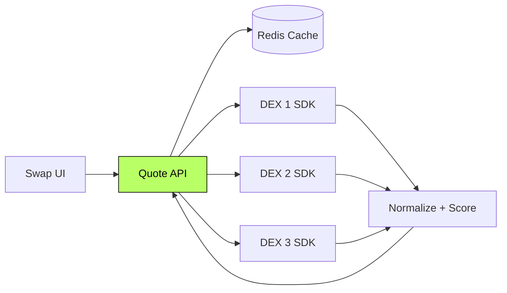

<div align="center">

```
   ██████╗ ███████╗██╗  ██╗
   ██╔══██╗██╔════╝╚██╗██╔╝
   ██║  ██║█████╗   ╚███╔╝
   ██║  ██║██╔══╝   ██╔██╗
   ██████╔╝███████╗██╔╝ ██╗
   ╚═════╝ ╚══════╝╚═╝  ╚═╝
```

# Cross-DEX Quote Aggregator API

#### Aggregates quotes across multiple DEXs, returns best route.
#### Powers swap UIs and downstream products.

[](#)
[](#)
[](#)
[](#)

</div>

---

> **TL;DR** — A backend service that asks several DEX SDKs for a quote,
> picks the best route, and returns it under tight latency. The kind of
> infrastructure that quietly powers swap UIs.

---

## Overview

A quote aggregation API for token swaps. Queries multiple DEX SDKs in
parallel, normalizes responses, accounts for slippage and gas, and returns
the best route. Designed for the latency budget of a real swap UI.

> This repository documents the system at the **architectural level**.
> Implementation code is private.

---

## My Role

> **Backend Engineer.** Service design, latency engineering, caching layer.

- Service architecture (NestJS)
- DEX SDK adapter layer
- Latency-bounded parallel fetch
- Caching strategy (Redis)
- Slippage and gas accounting

---

## Architecture



---

## Capabilities

- **Multi-DEX parallel quoting** with timeout budget
- **Best-route scoring** including slippage and gas
- **Cache layer** for hot pairs
- **Adapter pattern** — adding a new DEX is bounded work

---

## Architectural Decisions & Tradeoffs

### 1. Latency budget enforced, not hoped for

Every downstream SDK call has a hard timeout. Slow venues don't slow down
the overall quote.

### 2. Adapters normalize, the core picks

Each DEX has a different response shape. Adapters normalize. The core
scoring logic is shape-agnostic.

### 3. Cache hot pairs, not all pairs

Hot pairs benefit; long-tail pairs would just pollute the cache. The line
is drawn explicitly.

---

## Engineering Invariants

- **Never** let one slow DEX block the response
- **Never** return a quote without slippage and gas accounted for
- **Never** cache an authoritative answer — quotes are always fresh-or-flagged

---

## Related Public Documents

- [`market-making-infra`](https://github.com/eldardzh/market-making-infra) — companion execution layer
- [`multichain-contracts`](https://github.com/eldardzh/multichain-contracts) — on-chain side

---

<div align="center">

#### **Contact**
[**eldardzh.com**](https://eldardzh.com) · [**@EldarDissmay**](https://x.com/EldarDissmay) · **dissmay21@gmail.com**

<sub>© 2026 · Eldar D.</sub>

</div>
